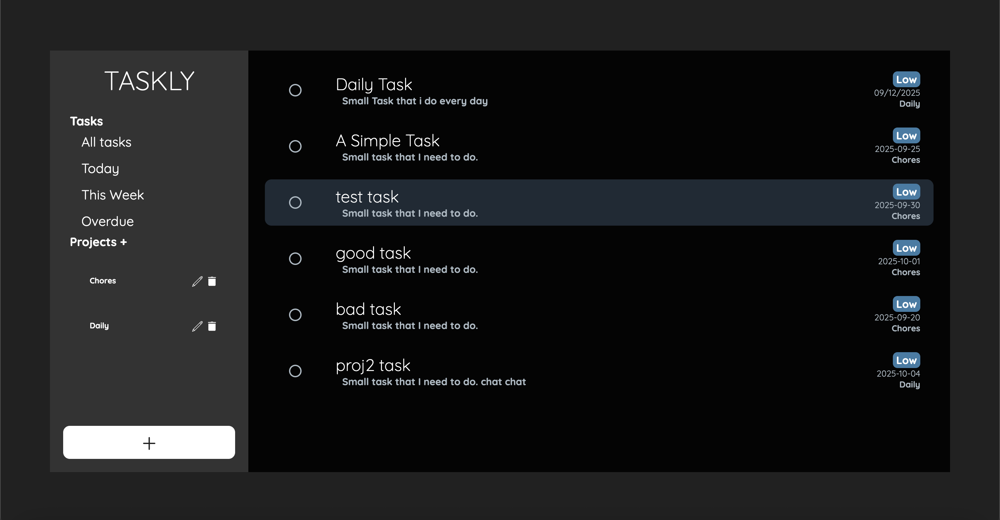

# 🗂️ Taskly

**Taskly** is a simple yet powerful to-do list and project management web app built using **vanilla JavaScript**, **HTML**, and **CSS**, bundled with **Webpack**.  
It allows users to create and manage projects, add tasks with priorities and deadlines, and view tasks by day, week, or overdue status — all data is persisted locally via **localStorage**.

---

## ✨ Features

- 📁 **Project Management** — Create, rename, and delete projects easily.  
- ✅ **Task Management** — Add tasks with a title, description, due date, and priority.  
- 💾 **Local Storage Persistence** — Automatically saves all projects and tasks in localStorage.  
- 🧭 **Dynamic UI** — Interactive sidebar and modal dialogs for adding or managing items.  
- 📆 **Calendar View** — View tasks for today, this week, or see overdue ones.  

---

## 🧱 Project Structure

```
TODO LIST/
├── dist/
├── node_modules/
├── src/
│   ├── assets/
│   │   ├── delete.png
│   │   └── edit.png
│   ├── dialog.css
│   ├── reminders.css
│   ├── styles.css
│   ├── template.html
│   ├── index.js
│   ├── displayDriver.js
│   └── localStorageFunc.js
├── package.json
├── webpack.common.js
├── webpack.dev.js
├── webpack.prod.js
└── README.md
```

---

## ⚙️ Setup & Installation

1. **Clone the repository**
   ```bash
   git clone https://github.com/yourusername/taskly.git
   cd taskly
   ```

2. **Install dependencies**
   ```bash
   npm install
   ```

3. **Run the development server**
   ```bash
   npm run start
   ```

4. **Build for production**
   ```bash
   npm run build
   ```

---

## 🧩 Technologies Used

- JavaScript (ES6 Modules)
- HTML5 / CSS3
- Webpack
- LocalStorage API

---

## 📸 Preview



A clean and minimalistic UI that helps you focus on productivity — manage your tasks and projects effortlessly with dialog-based modals and categorized views.

---

## 🧑‍💻 Author

Developed by **Daniil** as part of The Odin Project.  
Feel free to fork, modify, and expand Taskly for your own use!

---
